# Site-to-Site VPN Architecture

A site-to-site VPN connects Azure and AWS using IPSec/IKE tunnels. Azure’s VPN gateway exposes dual public IPs and learns AWS routes via BGP or a static UDR, while AWS’s virtual private gateway terminates the tunnels and advertises Azure prefixes. Application subnets on both clouds permit traffic restricted to the partner CIDR ranges, ensuring only east-west workloads traverse the encrypted tunnel.

```mermaid
---
config:
  look: neo
  theme: redux
  layout: elk
---
flowchart LR
 subgraph AzureVNet["Azure VNet (10.1.0.0/16)"]
        AzureVM["Azure VMs<br>10.1.1.0/24"]
        AppSubnet["App Subnet<br>10.1.1.0/24"]
        GWSubnet["Gateway Subnet<br>10.1.255.0/27"]
  end
 subgraph AzureCloud["Azure Cloud"]
        AzureVNet
        VNetGW["VPN Gateway<br>- IPSec termination<br>- BGP ASN: 65515"]
        AzurePIP1["Public IP 1"]
        AzurePIP2["Public IP 2<br>(Active/Active)"]
        LocalGW["Local Network GW<br>- AWS VGW IPs<br>- AWS: 10.2.0.0/16"]
        AzureRT["Route Table<br>Static: 10.2.0.0/16 → VPN GW<br>BGP: Auto-learned routes"]
        AzureNSG["NSG<br>Allow from 10.2.1.0/24"]
  end
 subgraph AWSVPC["AWS VPC (10.2.0.0/16)"]
        AWSEC2["EC2 Instances<br>10.2.1.0/24"]
        EC2Subnet["App Subnet<br>10.2.1.0/24"]
  end
 subgraph AWSCloud["AWS Cloud"]
        AWSVPC
        VGW["Virtual Gateway<br>- IPSec termination<br>- BGP ASN: 64512"]
        CGW["Customer Gateway<br>- Azure VPN IPs<br>- BGP ASN: 65515"]
        VPNConn["VPN Connection<br>- 2 tunnels per connection"]
        AWSRT["Route Table<br>Static: 10.1.0.0/16 → VGW<br>BGP: Auto-propagated"]
        AWSSG["Security Group<br>Allow from 10.1.1.0/24"]
  end
    AzureVM --> AppSubnet
    GWSubnet --> VNetGW
      VNetGW --> AzurePIP1
      VNetGW --> AzurePIP2
      VNetGW --> LocalGW
      AppSubnet --> AzureRT
      AppSubnet --> AzureNSG
    AWSEC2 --> EC2Subnet
    VGW --> VPNConn
    VPNConn --> CGW
      EC2Subnet --> AWSRT
      EC2Subnet --> AWSSG
    AWSRT --> VGW
    AzurePIP1 -.-> Internet["Internet<br>IPSec Tunnels"]
    AzurePIP2 -.-> Internet
    Internet -.-> VPNConn
    AzureVM -- "1: App Traffic" --> VNetGW
    VNetGW -- "2: Encrypted" --> Internet
    Internet -- "3: IPSec" --> VGW
    VGW -- "4: Decrypted" --> AWSEC2

```

## Traffic Between Clouds

**Azure → AWS**
1. An Azure VM targets an AWS address (10.2.0.0/16); the subnet UDR or BGP-learned route sends 10.2.0.0/16 to the VPN gateway.
2. The subnet NSG allows the flow to the AWS CIDR, so packets reach the gateway subnet without being dropped.
3. The Azure VPN gateway encapsulates the traffic with IKEv2/IPsec and forwards it via its public IP into the primary tunnel.
4. AWS’s virtual private gateway decrypts the packets and hands them to the VPC route table, which directs 10.2.1.0/24 toward the application subnet.
5. The destination EC2 security group permits the Azure CIDR, so the workload processes the request.

**AWS → Azure**
1. An EC2 instance initiates traffic to 10.1.0.0/16; the VPC route table points that prefix at the VGW (or learns it via BGP).
2. The VGW encrypts the packets, uses the tunnel to reach the Azure VPN gateway, and preserves session state for redundancy.
3. The Azure VPN gateway decrypts the packets and forwards them to the application subnet because the route table recognizes the source as the partner CIDR.
4. The Azure NSG allows traffic from 10.2.1.0/24, so the packets reach the Azure VM and the response follows the same secure path back to AWS.

## Component Roles

- **Azure VNet (10.1.0.0/16)**: Aggregates Azure subnets; provides address space for workloads and the gateway subnet.
- **Azure Application Subnet (10.1.1.0/24)**: Hosts the application VMs; associates with NSGs/UDRs to control east-west routing.
- **Azure Gateway Subnet (10.1.255.0/27)**: Mandatory subnet where the Azure VPN gateway resides; no NSG support to avoid tunnel disruption.
- **Azure VPN Gateway**: Terminates IPSec tunnels, handles BGP or static routes, exposes redundant public IPs, and encapsulates traffic.
- **Azure Route Table**: Supplies static UDR to reach AWS when not using BGP; left empty when dynamic routing is enabled.
- **Azure NSG**: Enforces security policies on the application subnet, allowing only the AWS CIDR and required application ports.
- **Public Internet**: Carries the IPSec-encrypted traffic between Azure and AWS gateways over UDP 500/4500 and ESP.
- **AWS VPC (10.2.0.0/16)**: Provides the AWS addressing space that contains subnets for workloads and attachments.
- **AWS Application Subnet (10.2.1.0/24)**: Hosts EC2 instances that consume/serve application traffic from/to Azure.
- **AWS Virtual Private Gateway (VGW)**: Terminates IPSec tunnels on AWS side; injects prefixes into the VPC route tables.
- **AWS Customer Gateway (CGW)**: Represents the Azure VPN gateway in AWS; stores IPs/BGP ASN used by the connection.
- **AWS VPN Connection**: Logical pairing of tunnels between the VGW and CGW; each tunnel provides redundancy.
- **AWS Route Table**: Sends Azure-bound prefixes to the VGW when static; auto-propagates routes learned via BGP.
- **AWS Security Group**: Applies stateful firewall rules on EC2 instances, permitting only the Azure CIDR and required ports.

