# Site-to-Site VPN Architecture

A site-to-site VPN connects Azure and AWS using IPSec/IKE tunnels. Azure’s VPN gateway exposes dual public IPs and learns AWS routes via BGP or a static UDR, while AWS’s virtual private gateway terminates the tunnels and advertises Azure prefixes. Application subnets on both clouds permit traffic restricted to the partner CIDR ranges, ensuring only east-west workloads traverse the encrypted tunnel.

```mermaid
---
config:
  look: neo
  theme: redux
  layout: elk
---
flowchart LR
 subgraph AzureVNet["Azure VNet (10.1.0.0/16)"]
        AzureVM["Azure VMs<br>10.1.1.0/24"]
        AppSubnet["App Subnet<br>10.1.1.0/24"]
        GWSubnet["Gateway Subnet<br>10.1.255.0/27"]
  end
 subgraph AzureCloud["Azure Cloud"]
        AzureVNet
        VNetGW["VPN Gateway<br>- IPSec termination<br>- BGP ASN: 65515"]
        AzurePIP1["Public IP 1"]
        AzurePIP2["Public IP 2<br>(Active/Active)"]
        LocalGW["Local Network GW<br>- AWS VGW IPs<br>- AWS: 10.2.0.0/16"]
        AzureRT["Route Table<br>Static: 10.2.0.0/16 → VPN GW<br>BGP: Auto-learned routes"]
        AzureNSG["NSG<br>Allow from 10.2.1.0/24"]
  end
 subgraph AWSVPC["AWS VPC (10.2.0.0/16)"]
        AWSEC2["EC2 Instances<br>10.2.1.0/24"]
        EC2Subnet["App Subnet<br>10.2.1.0/24"]
  end
 subgraph AWSCloud["AWS Cloud"]
        AWSVPC
        VGW["Virtual Gateway<br>- IPSec termination<br>- BGP ASN: 64512"]
        CGW["Customer Gateway<br>- Azure VPN IPs<br>- BGP ASN: 65515"]
        VPNConn["VPN Connection<br>- 2 tunnels per connection"]
        AWSRT["Route Table<br>Static: 10.1.0.0/16 → VGW<br>BGP: Auto-propagated"]
        AWSSG["Security Group<br>Allow from 10.1.1.0/24"]
  end
    AzureVM --> AppSubnet
    GWSubnet --> VNetGW
      VNetGW --> AzurePIP1
      VNetGW --> AzurePIP2
      VNetGW --> LocalGW
      AppSubnet --> AzureRT
      AppSubnet --> AzureNSG
    AWSEC2 --> EC2Subnet
    VGW --> VPNConn
    VPNConn --> CGW
      EC2Subnet --> AWSRT
      EC2Subnet --> AWSSG
    AWSRT --> VGW
    AzurePIP1 -.-> Internet["Internet<br>IPSec Tunnels"]
    AzurePIP2 -.-> Internet
    Internet -.-> VPNConn
    AzureVM -- "1: App Traffic" --> VNetGW
    VNetGW -- "2: Encrypted" --> Internet
    Internet -- "3: IPSec" --> VGW
    VGW -- "4: Decrypted" --> AWSEC2

```




## Traffic Between Clouds

**Azure → AWS**
1. An Azure VM targets an AWS address (10.2.0.0/16); the subnet UDR or BGP-learned route forwards that prefix to the Azure VPN gateway.
2. The subnet NSG allows outbound traffic to the AWS CIDR on the required application ports, so packets reach the gateway subnet.
3. The Azure VPN gateway encapsulates the flow with IKEv2/IPsec and sends it out one of its public IPs through the primary tunnel.
4. AWS’s virtual private gateway decrypts the packets and relies on the VPC’s local route to deliver them into the 10.2.1.0/24 application subnet.
5. The destination EC2 security group allows traffic from the Azure CIDR on the same application ports, so the workload accepts the request.

**AWS → Azure**
1. An EC2 instance sends traffic toward Azure (10.1.0.0/16); the VPC route table directs that prefix to the VGW or relies on BGP-learned routes.
2. The EC2 security group allows outbound traffic to the Azure CIDR on the needed application ports, so the flow reaches the VGW.
3. The VGW encapsulates the packets with IKEv2/IPsec, forwards them across the active tunnel, and maintains the session in case of failover.
4. The Azure VPN gateway decrypts the packets and uses its route table (BGP-learned or static UDR) to send them toward the application subnet.
5. The Azure NSG permits inbound traffic from the AWS CIDR on those application ports, so the Azure VM processes the request and replies over the same tunnel.

## Component Roles

- **Azure VNet (10.1.0.0/16)**: Aggregates Azure subnets; provides address space for workloads and the gateway subnet.
- **Azure Application Subnet (10.1.1.0/24)**: Hosts the application VMs; associates with NSGs/UDRs to control east-west routing.
- **Azure Gateway Subnet (10.1.255.0/27)**: Mandatory subnet where the Azure VPN gateway resides; no NSG support to avoid tunnel disruption.
- **Azure VPN Gateway**: Terminates IPSec tunnels, handles BGP or static routes, exposes redundant public IPs, and encapsulates traffic.
- **Azure Route Table**: Supplies static UDR to reach AWS when not using BGP; left empty when dynamic routing is enabled.
- **Azure NSG**: Enforces security policies on the application subnet, allowing only the AWS CIDR and required application ports.
- **Public Internet**: Carries the IPSec-encrypted traffic between Azure and AWS gateways over UDP 500/4500 and ESP.
- **AWS VPC (10.2.0.0/16)**: Provides the AWS addressing space that contains subnets for workloads and attachments.
- **AWS Application Subnet (10.2.1.0/24)**: Hosts EC2 instances that consume/serve application traffic from/to Azure.
- **AWS Virtual Private Gateway (VGW)**: Terminates IPSec tunnels on AWS side; injects prefixes into the VPC route tables.
- **AWS Customer Gateway (CGW)**: Represents the Azure VPN gateway in AWS; stores IPs/BGP ASN used by the connection.
- **AWS VPN Connection**: Logical pairing of tunnels between the VGW and CGW; each tunnel provides redundancy.
- **AWS Route Table**: Sends Azure-bound prefixes to the VGW when static; auto-propagates routes learned via BGP.
- **AWS Security Group**: Applies stateful firewall rules on EC2 instances, permitting only the Azure CIDR and required ports.

## AWS Transit Gateway Considerations

**Q. In this site-to-site VPN between Azure and AWS, is AWS Transit Gateway required?**

**A.** No. A basic Azure ↔ AWS VPN works with just a Virtual Private Gateway (VGW). Use the checklist below to decide when VGW alone is enough and when Transit Gateway (TGW) is worth the added cost and complexity.

**When a VGW Is Sufficient**
- Single VPC connecting to Azure or a simple hub-and-spoke design.
- Fewer than 10 simultaneous VPN connections (VGW limit per gateway).
- Standard redundancy needs (each connection provides two tunnels).
- Throughput expectations within the ~1.25 Gbps-per-tunnel envelope.
- Cost-sensitive deployments where TGW hourly and per-GB charges would be wasteful.

**When Transit Gateway Becomes Valuable**
- Multiple VPCs (or on-premises networks) must share the Azure tunnel.
- You need transitive routing—VPC-to-VPC traffic over the same hub.
- Centralized management of many VPNs, VPCs, or Direct Connect links.
- Requirements for advanced routing (per-attachment route tables, ECMP, segregation by policy).
- Aggregate VPN throughput or connection count exceeds VGW limits.

**Cost Snapshot (US regions, Oct 2025)**
- VGW: no hourly fee for the gateway itself; each Site-to-Site VPN connection is ~$0.05/hour (~$36/month) with no TGW-style per-GB processing charge (standard VPC data transfer rates still apply).
- TGW: each VPC/VPN attachment is ~$0.05/hour (~$36/month) **plus** $0.02/GB processed, so multi-VPC designs scale in price.

**Architecture at a Glance**
```
Simple VGW:   Azure VNet ⇄ VPN ⇄ VGW ⇄ Single VPC
TGW Hub:      Azure VNet ⇄ VPN ⇄ TGW ⇄ VPC A / VPC B / VPC C / On‑prem
```

**Quick Decision Tree**
```
Do multiple AWS VPCs need Azure access?
├─ No → Use VGW ✓
└─ Yes → Do those VPCs need to talk to each other?
         ├─ No → Use separate VGWs (one per VPC)
         └─ Yes → Use Transit Gateway
```

**Recommendation**
- For LiteObject’s current single-VPC diagram, keep the VGW. It is simpler, cheaper, and fully supported by Azure’s VPN gateway.
- Revisit TGW only if you grow into a multi-VPC mesh, need shared services across VPCs, or require higher aggregate throughput with ECMP.

