# Site-to-Site VPN Architecture

A site-to-site VPN connects Azure and AWS using IPSec/IKE tunnels. Azure’s VPN gateway exposes dual public IPs and learns AWS routes via BGP or a static UDR, while AWS’s virtual private gateway terminates the tunnels and advertises Azure prefixes. Application subnets on both clouds permit traffic restricted to the partner CIDR ranges, ensuring only east-west workloads traverse the encrypted tunnel.

```mermaid
---
config:
  look: neo
  theme: redux
  layout: elk
---
flowchart LR
 subgraph AzureVNet["Azure VNet (10.1.0.0/16)"]
        AzureVM["Azure VMs<br>10.1.1.0/24"]
        AppSubnet["App Subnet<br>10.1.1.0/24"]
        GWSubnet["Gateway Subnet<br>10.1.255.0/27"]
  end
 subgraph AzureCloud["Azure Cloud"]
        AzureVNet
        VNetGW["VPN Gateway<br>- IPSec termination<br>- BGP ASN: 65515"]
        AzurePIP1["Public IP 1"]
        AzurePIP2["Public IP 2<br>(Active/Active)"]
        LocalGW["Local Network GW<br>- AWS VGW IPs<br>- AWS: 10.2.0.0/16"]
        AzureRT["Route Table<br>Static: 10.2.0.0/16 → VPN GW<br>BGP: Auto-learned routes"]
        AzureNSG["NSG<br>Allow from 10.2.1.0/24"]
  end
 subgraph AWSVPC["AWS VPC (10.2.0.0/16)"]
        AWSEC2["EC2 Instances<br>10.2.1.0/24"]
        EC2Subnet["App Subnet<br>10.2.1.0/24"]
  end
 subgraph AWSCloud["AWS Cloud"]
        AWSVPC
        VGW["Virtual Gateway<br>- IPSec termination<br>- BGP ASN: 64512"]
        CGW["Customer Gateway<br>- Azure VPN IPs<br>- BGP ASN: 65515"]
        VPNConn["VPN Connection<br>- 2 tunnels per connection"]
        AWSRT["Route Table<br>Static: 10.1.0.0/16 → VGW<br>BGP: Auto-propagated"]
        AWSSG["Security Group<br>Allow from 10.1.1.0/24"]
  end
    AzureVM --> AppSubnet
    GWSubnet --> VNetGW
      VNetGW --> AzurePIP1
      VNetGW --> AzurePIP2
      VNetGW --> LocalGW
      AppSubnet --> AzureRT
      AppSubnet --> AzureNSG
    AWSEC2 --> EC2Subnet
    VGW --> VPNConn
    VPNConn --> CGW
      EC2Subnet --> AWSRT
      EC2Subnet --> AWSSG
    AWSRT --> VGW
    AzurePIP1 -.-> Internet["Internet<br>IPSec Tunnels"]
    AzurePIP2 -.-> Internet
    Internet -.-> VPNConn
    AzureVM -- "1: App Traffic" --> VNetGW
    VNetGW -- "2: Encrypted" --> Internet
    Internet -- "3: IPSec" --> VGW
    VGW -- "4: Decrypted" --> AWSEC2

```

